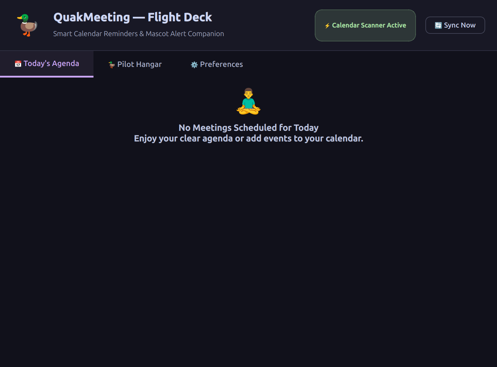
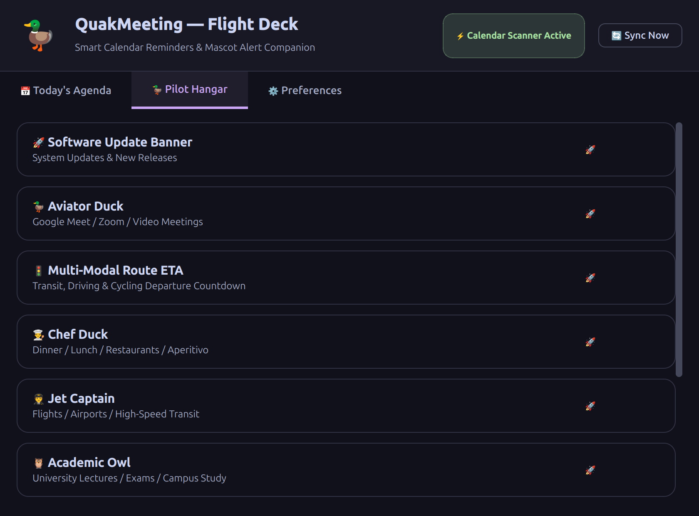
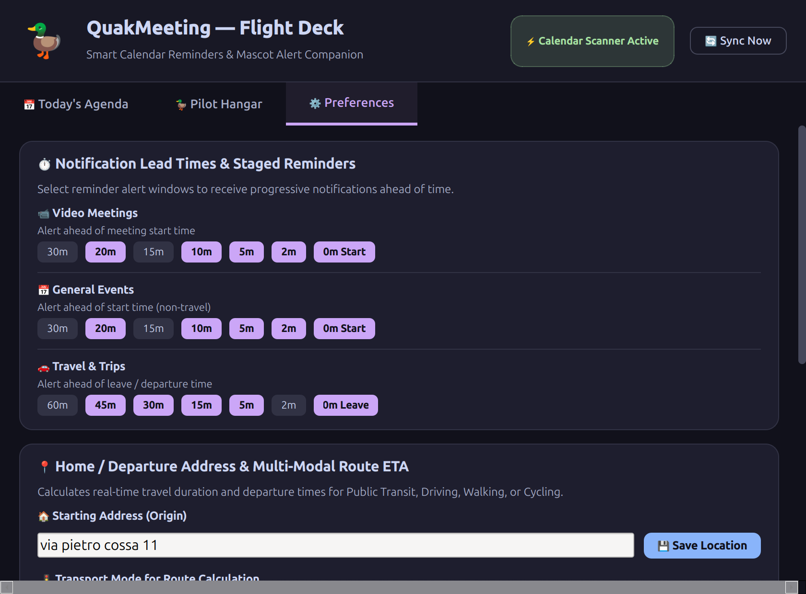
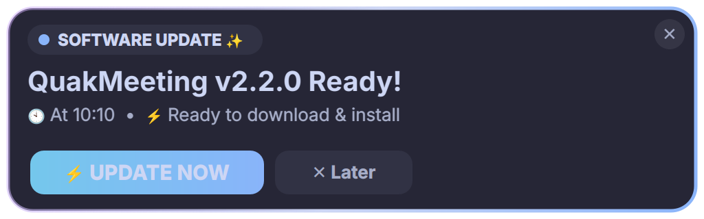
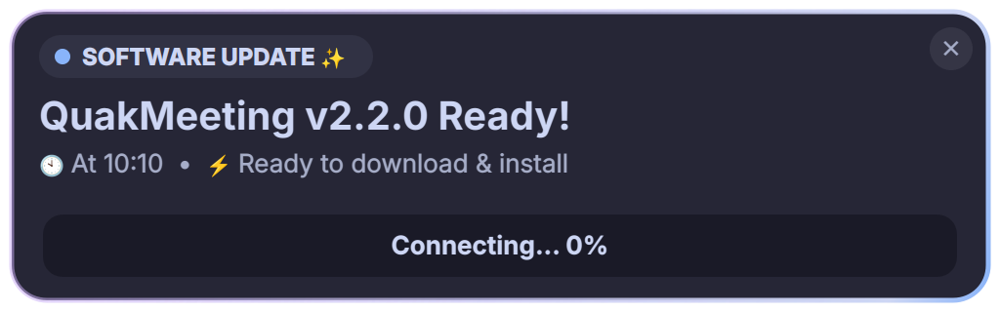
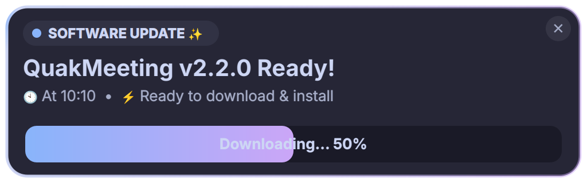
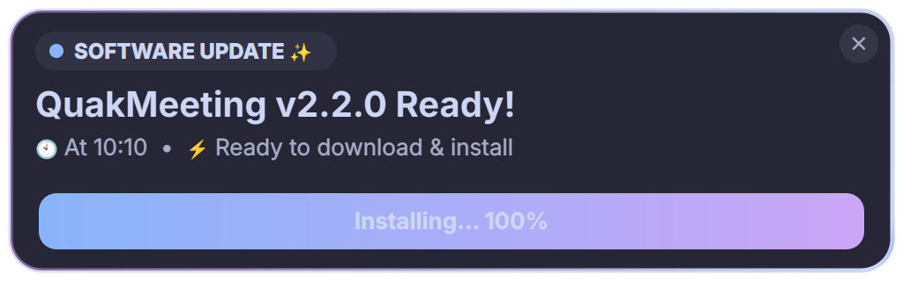
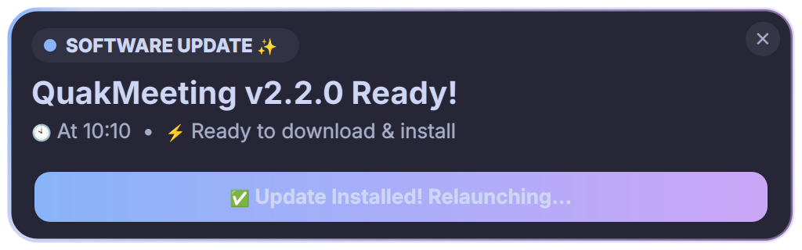

# QuakMeeting UI Architecture & Components

This document provides a comprehensive overview of the **QuakMeeting UI architecture**. 
The application aims for a seamless, unified experience across both **macOS (AppKit)** and **Ubuntu Linux (PyQt6)**.

---

## 🖼️ UI Visual Gallery

### 🐧 Ubuntu (PyQt6)
*These screenshots demonstrate the native Qt6 Linux implementation, utilizing custom `QPainter` drawing to deliver rich, fluid animations natively on X11 & Wayland without relying on buggy compositing effects.*

#### 1. Flight Deck (Main Dashboard)
The primary control center, built as a frameless, dark-glass window. It's separated into three core tabs for distinct workflows:
````carousel

<!-- slide -->

<!-- slide -->

````

#### 2. Flying Banners System (Notifications)
Translucent, floating alert cards that "fly" onto the screen. They are logically separated for clean architecture (`qt_duck_banner.py` and `qt_update_banner.py`).

**The Duck Banner (Meetings & Travel)**
Features the animated tow-cable and a dynamically rendered mascot jet.


**The Update Banner (Software Updates)**
Features a hyper-smooth, glowing `QLinearGradient` sweep along its border.


#### 3. In-Banner Inline Updating Sequence
When "Update" is clicked on the banner, it transforms its action buttons into an embedded progress bar, syncs with the system installer, accelerates its glowing border sweep by 5x, and finally slides gracefully out of the screen.
````carousel

<!-- slide -->

<!-- slide -->

<!-- slide -->

````

#### 4. Updating HUD (Preferences Tab)
A complex, multi-phase widget featuring a flying jet, thruster flames, rotating gears, and a confetti burst.
````carousel

<!-- slide -->

<!-- slide -->

````

### 🍎 macOS (AppKit)
*(TODO: Insert native macOS AppKit `.swift` / `.xib` screenshots and animation sequences here. The macOS visuals will mirror the Linux layout but utilize native CoreAnimation and UIVisualEffectViews).*

---

## 📂 Core Directory Structure

The Linux UI logic is exclusively contained within the `ui/linux/` package:
- `qt_dashboard.py` — The main "Flight Deck" window.
- `animated_widgets.py` — Custom, glitch-free animated UI elements.
- `system_tray.py` — The top menu bar integration (AppIndicator).
- `style.qss` — Global Qt stylesheet.
- `banner/` — The flying banner notification system.

## 💻 System Tray & Top Bar
**File:** [ui/linux/system_tray.py](file:///home/antonino54/Documents/Project/QuakMeeting/ui/linux/system_tray.py)

QuakMeeting embeds deeply into the desktop environment using `pystray` and AppIndicator:
* Runs silently in the background.
* Provides a native dropdown menu showing the "Next Event" in real-time.
* Serves as the persistent anchor, allowing the main Flight Deck window to be closed and reopened at will without terminating the core reminder engine.
