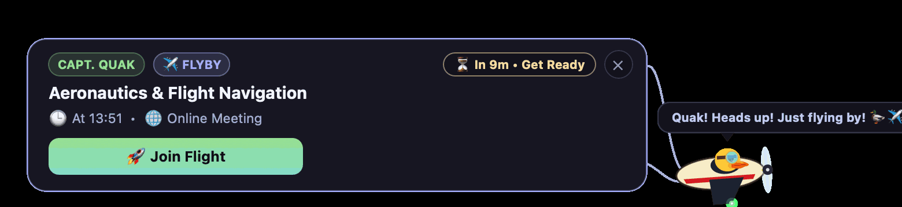
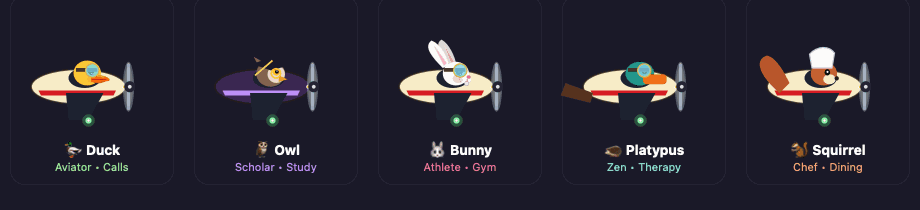
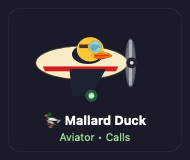
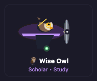
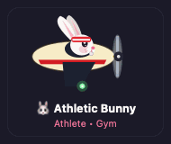
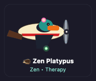
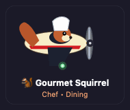
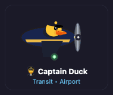
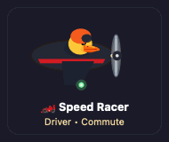

<div align="center">

# 🦆 QuakMeeting
### Multiplatform Native Flight Deck & Smart Meeting Reminder Assistant
*macOS (Sonoma / Sequoia), Ubuntu Linux (Wayland / X11), & Microsoft Windows (10 / 11)*  
*Inspired by [QuakPit](https://github.com/Ooble-Studio/QuakPit) — Designed for Timing Precision, Travel Readiness, & 1-Click Meeting Joins.*

[](https://apple.com)
[-orange?logo=ubuntu&style=flat-square)](https://ubuntu.com)
[](https://microsoft.com/windows)
[](https://python.org)
[](https://github.com/Antonino545/QuakMeeting/releases)
[](LICENSE)


</div>

---

## 📖 Overview & Philosophy

**QuakMeeting** is a lightweight multiplatform companion application built to solve one of the biggest daily productivity challenges: **forgetting upcoming video calls, missing transit departure times, or losing track of time during deep work.**

Instead of tiny, easily-missed system notification banners, QuakMeeting animates a **mascot aircraft towing an interactive HUD banner** across your display:
- **macOS**: Built with native **AppKit / Quartz 2D** with frosted glass cards, smooth 60fps animations, and in-process runtime.
- **Ubuntu Linux (Wayland & X11)**: Native **PyQt6** animated overlay banner with solid Catppuccin cards and **GNOME AppIndicator3** status item.
- **Microsoft Windows (10 & 11)**: Native **PyQt6** animated overlay banner, system tray integration (`QSystemTrayIcon`), registry launch-at-login, and native audio via `winsound`.

<div align="center">
  
</div>

---

## ✨ Key Features

- 💡 **Context Engine & "Why?" Transparency Authority (`core/domain/context_engine.py`)**:
  - **Actionable Decision Engine**: Evaluates real-time calendar items, commute times, and presence to answer: *"What is the ONE action I should take right now, and why?"* (`LEAVE_NOW`, `PREPARE_DEPARTURE`, `JOIN_CALL`, `HEAD_TO_CLASS`, `ACTIVE_SESSION`, `RELAX`).
  - **Transparent Rationale ("Why?" Box)**: Clear human-readable explanations behind every prompt (e.g. *"Departure deadline reached: ~25m travel + 10m buffer to reach venue on time"* or *"Attending Zoom call: notification banners suppressed"*).
  - **Dynamic Active Session Focus & Motivation**: Dynamic countdown and exact finish time (`Ends in 1h 45m (until 17:00)`), coupled with category-tailored encouragement:
    - 📖 **Study**: `📖 Study session in progress • ~1h 45m remaining (until 17:00) • Good luck & stay focused!`
    - 🎯 **Exam**: `🎯 Exam in progress • ~1h 30m remaining (until 11:30) • Good luck!`
    - 🎓 **Lecture**: `🎓 Lecture in progress • ~45m remaining (until 16:00)`
    - 🏋️ **Workout**: `🏋️ Workout in progress • ~30m remaining (until 19:30) • Keep pushing!`
    - 🍽️ **Meal**: `🍽️ Meal in progress • ~40m remaining (until 14:00) • Enjoy your meal!`
    - 🧘 **Wellness**: `🧘 Wellness session in progress • ~25m remaining (until 18:00) • Relax & recharge`
  - **Command Center Bucketing (`ui/common/agenda_viewmodel.py`)**: Partitions Today's Agenda into `⚡ NOW` (Hero Card), `⏰ NEXT`, `📅 LATER`, and `🏁 EARLIER TODAY` buckets.
- 🖥️ **Flight Deck Control Center (`ui/macos/dashboard_window.py` & `ui/linux/qt_dashboard.py`)**:
  - **📅 Today's Agenda**: Timeline of all today's events, departure countdowns, dynamic Hero Card, and 1-click launch / navigation actions.
  - **🦆 Pilot Hangar**: Interactive flight test playground for all mascot species, pilot personas, and multi-layer accessories.
  - **⚙️ Preferences & Timing**: Customizable staged alert windows (e.g. 45m, 30m, 20m, 15m, 10m, 5m, 2m, 0m), starting location for Apple/Google Maps ETA, chimes, and calendar feeds.
- 🌐 **Bilingual Multi-Language Support (English & Italiano)**:
  - Automatically detects system language from macOS `NSLocale` or Linux `$LANG`.
  - Manual language switcher in Settings (`🌐 System (Auto)`, `🇬🇧 English`, `🇮🇹 Italiano`).
  - Bilingual animal speech bubbles, badges, countdown timers, and in-app license viewers.
- 🚗 **Real-Time Travel & Multi-Modal ETA Engine**:
  - Automatically calculates transit, driving, walking, or cycling duration with configurable departure buffers.
  - Triggers alerts relative to **Leave Time** instead of meeting start time.
  - 1-Click deep links to **Apple Maps** (macOS) or **Google Maps Directions** (Linux).
- ✈️ **8 Mascot Animal Species & 9 Specialized Pilot Personas**:
  - Distinct species: **Duck, Owl, Bunny, Platypus, Squirrel, Fox, Penguin, and Panda**.
  - Multi-layer accessory compositing system (Fedora, Aviator Goggles, Pilot Helmet, Graduation Cap, Crown, Sunglasses, Scarf, and more).
- 🔄 **In-App GitHub Releases Auto-Updater**:
  - Checks for updates automatically with live download/installation progress tracking.
- ⚡ **Multiplatform Calendar Sync & Recurrence Engine**:
  - **macOS**: Native Apple EventKit API bridge (`EventKitProvider`).
  - **Linux & Windows**: Universal iCalendar / CalDAV engine (`CalDAVProvider`) syncing Google Calendar, iCloud, Nextcloud, and university/work `.ics` feeds.
  - **Intelligent Today `RRULE` Recurrence**: Automatically expands daily, weekly, and monthly repeating events (`BYDAY`, `INTERVAL`, `UNTIL`, `COUNT`, `EXDATE`) strictly for Today.
  - **Timezone-Aware (`TZID`) & Offline Resilient**: Resolves native IANA timezones via Python stdlib `zoneinfo` and maintains fallback cache on transient network drops.
- 🚀 **Universal 1-Click Meeting Detection**:
  - Automatically identifies video conference links and launches them in 1 click: **Google Meet, Zoom, Microsoft Teams, Cisco Webex, Jitsi Meet, Whereby, GoToMeeting, Skype, Discord, Slack Huddle**, and telemedicine portals (**Serenis**).
- 📍 **Smart Presence & Auto-Arrival Detection**:
  - Automatically suppresses redundant reminder banners when already in an active video call (Zoom, Teams, Webex, Skype, Slack) or connected to venue Wi-Fi (Eduroam, university campus, office networks).
  - Dedicated Settings card with customizable SSIDs, call/Wi-Fi toggles, live presence diagnostics, and transparent badges in Today's Agenda (`[✅ Arrived]`, `[🟢 In Call]`, `[📍 On Site]`).
- 🗄️ **Robust SQLite ACID State Storage (`core/services/database_service.py`)**:
  - Centralized SQLite database (`~/.quakmeeting/quakmeeting.db`) with WAL mode, foreign keys, and sandboxed in-memory test fallback.
- 🔒 **Privacy-First & Local**: No telemetry, tracking, or cloud account requirements.

---

## 🦆 Mascot Animal Roster & Pilot Personas

QuakMeeting features a rich squadron of animal pilots automatically chosen based on event classification. Each pilot features dynamic flight physics including high-RPM spinning propellers, wingtip navigation strobe beacons, vertical wave bobbing, blinking expressions, and fluttering accessories in the slipstream:

<div align="center">
  
  <p><em>From left to right: Mallard Duck, Wise Owl, Athletic Bunny, Zen Platypus, and Gourmet Squirrel in formation flight.</em></p>
</div>

| Live Animation | Mascot Animal | Persona | Accent Color | Triggers & Context | 1-Click Action |
| :---: | :--- | :--- | :--- | :--- | :--- |
|  | 🦆 **Mallard Duck** | **Aviator Pilot** | Catppuccin Green | Google Meet, Zoom, MS Teams, Webex, Jitsi, Whereby, Skype, Discord, Slack calls | `[🚀 JOIN MEETING]` |
|  | 🦉 **Wise Owl** | **Academic Scholar** | Catppuccin Mauve | University lectures, exams, campus study, research | `[📚 CLASSROOM & NOTES]` |
|  | 🐰 **Athletic Bunny** | **Gym & Sport Hero** | Catppuccin Red | Palestra, Gym, CrossFit, Padel, Tennis, Football, Running | `[🗺️ GYM DIRECTIONS]` |
|  | 🕵️ **Perry the Platypus** | **Secret Agent / Zen** | Catppuccin Teal | Confidential missions, Serenis, Therapy, Yoga, Meditation | `[🛋️ JOIN SESSION]` |
|  | 🐿️ **Gourmet Squirrel** | **Chef & Foodie** | Catppuccin Peach | Dinner, Lunch, Restaurant, Pizzeria, Sushi, Cooking | `[🗺️ RESTAURANT MAPS]` |
|  | 🧑‍✈️ **Captain Duck** | **Airline & Train Pilot**| Catppuccin Sapphire | Flights, Airports, High-speed trains, Buses, Transit | `[🗺️ TRANSIT / AIRPORT]` |
|  | 🏎️ **Speed Racer** | **Driver** | Catppuccin Yellow | Appointments, Doctor, Dentist, Errands, Commutes | `[🗺️ NAVIGATE MAPS]` |
| 🦊 | 🦊 **Fox Strategist** | **Tactical Strategist** | Catppuccin Flamingo | Hackathons, Sprint Planning, Brainstorming, Strategy syncs | `[💡 STRATEGY SYNC]` |
| 🐧 | 🐧 **Dapper Penguin** | **Executive Presenter** | Catppuccin Lavender | Keynotes, Client demos, Board meetings, Formal presentations | `[📊 OPEN DECK]` |
| 🐼 | 🐼 **Chill Panda** | **Deep Focus Master** | Catppuccin Rosewater | Solo study, Pomodoro deep work blocks, Calm focus | `[🧘 FOCUS MODE]` |

### 🎩 Modular Accessory & Customization System
In the **Pilot Hangar**, customize your mascot with layered accessories:
`Animal → Outfit → Accessories → Slipstream Effects`
- **13 Accessories**: Fedora, Aviator Goggles, Pilot Helmet, Graduation Cap, Crown, Headphones, Bow Tie, Scarf, Sunglasses, Briefcase, Badge, Earpiece, and Cap.
- Multi-layer rendering engine supported across both macOS Quartz and Linux/Windows Qt.

---

## 📸 Visual Showcase & Multiplatform Parity

QuakMeeting delivers a unified **Catppuccin Mocha** visual experience across macOS (AppKit) and Linux (PyQt6). For complete implementation specifications, see [📐 UI Architecture & Design Tokens](docs/ARCHITECTURE.md#ui-architecture--visual-parity).

### 🦆 Pilot Hangar Playground
*Interactive test flight simulator featuring dedicated Catppuccin accent buttons for all mascot pilots.*

| 🍎 macOS (Native AppKit) | 🐧 Ubuntu Linux (PyQt6 / Wayland) |
| :---: | :---: |
|  |  |

### ⚙️ Preferences & Timing Flight Deck
*Customizable staged reminder lead times (quick presets & dynamic pill chips), language switcher, multi-modal routing, and calendar feeds.*

| 🍎 macOS (Native AppKit) | 🐧 Ubuntu Linux (PyQt6 / Wayland) |
| :---: | :---: |
|  |  |

---

## 📦 Download & Installation

### 🍎 macOS (`.dmg` Installer)
1. Download **`QuakMeeting-macOS.dmg`** from [Latest Releases](https://github.com/Antonino545/QuakMeeting/releases/latest).
2. Open the DMG and drag **QuakMeeting** into `/Applications`.
3. Launch `QuakMeeting.app` from Launchpad or Spotlight.
   > **Note on Gatekeeper**: If macOS reports the app is unsigned from GitHub, simply run:
   > ```bash
   > xattr -cr /Applications/QuakMeeting.app
   > ```
   > *(Or right-click `QuakMeeting.app` in Finder and select **Open**).*

### 🐧 Ubuntu Linux (`.deb` Package)
1. Download **`quakmeeting_1.0.5_amd64.deb`** from [Latest Releases](https://github.com/Antonino545/QuakMeeting/releases/latest).
2. Install via terminal:
   ```bash
   sudo apt install ./quakmeeting_1.0.5_amd64.deb
   ```
3. Launch **QuakMeeting** from your Application Grid or run `quakmeeting`.

### 📦 Flatpak (Universal Linux)
Build and install standalone Flatpak bundle:
```bash
# Build standalone bundle
bash scripts/build_flatpak.sh

# Install and run
flatpak install --user flatpak_dist/quakmeeting.flatpak
flatpak run com.quakmeeting.QuakMeeting
```

### 🪟 Microsoft Windows (`.zip` Standalone / Portable)
1. Download **`QuakMeeting-Windows.zip`** from [Latest Releases](https://github.com/Antonino545/QuakMeeting/releases/latest).
2. Extract the ZIP archive anywhere on your PC.
3. Double-click **`run_windows.bat`** (or `QuakMeeting.exe`) to launch!
   *(Or clone the repository and run with Python 3.10+: `pip install -r requirements-windows.txt` then `python main.py`)*

---

## 🏗️ Project Architecture

```text
QuakMeeting/
├── main.py                        # App entry point & CLI flag dispatcher (--debug, --qt, --pilot)
├── build_macos_app.py             # Bundles standalone macOS .app with embedded Python & codesign
├── scripts/
│   ├── build_ubuntu_deb.sh        # Debian/Ubuntu .deb package builder for Linux (Wayland/X11)
│   ├── build_windows_release.py   # Windows standalone PyInstaller release packager
│   ├── run_windows.bat            # Double-clickable Windows runner script
│   └── install_linux_deps.sh      # Installs system dependencies for Linux
├── assets/                        # App icons (PNG & ICNS), audio files
├── core/
│   ├── domain/
│   │   ├── models.py              # Meeting dataclass, PilotType, TransportMode, format_duration()
│   │   ├── context_engine.py      # Context Engine & "Why?" Transparency authority (TransitionGuidance)
│   │   ├── state_machine.py       # EventState deterministic lifecycle machine (NOW/NEXT/LATER)
│   │   ├── reminder_policy.py     # Strategy-based ReminderPolicy & ReminderPolicyRegistry
│   │   ├── capabilities.py        # EventCapabilities presentation and action flags
│   │   └── classifier.py          # Bilingual keyword taxonomy matching & smart categorization
│   ├── providers/
│   │   ├── base.py                # BaseCalendarProvider abstract class
│   │   ├── eventkit_provider.py   # Native Apple EventKit bridge (macOS)
│   │   ├── eds_provider.py        # GNOME Evolution Data Server calendar provider (Linux)
│   │   └── caldav_provider.py     # CalDAV / .ics provider with Today RRULE expansion & TZID (Linux/Windows)
│   ├── services/
│   │   ├── database_service.py    # Centralized ACID SQLite state storage (~/.quakmeeting/quakmeeting.db)
│   │   ├── calendar_service.py    # Synchronizes & caches Today-only events (00:00 to 23:59:59)
│   │   ├── reminder_engine.py     # Multi-stage notification triggers (evaluates leave vs start time)
│   │   ├── notification_service.py # Unified NotificationProvider architecture (Mascot, System, Sound)
│   │   ├── eta_service.py         # Multi-modal routing & Apple/Google Maps URL builder
│   │   ├── language_service.py    # OS detection & centralized English/Italian dictionary
│   │   ├── updater_service.py     # GitHub Releases auto-updater
│   │   ├── arrival_service.py     # Automatic/manual arrival detection and suppression
│   │   ├── config_service.py      # Configuration manager (~/.quakmeeting/config.json)
│   │   └── event_bus.py           # Decoupled pub/sub event system
│   └── logger.py                  # Dual console & file logger (~/.quakmeeting/quakmeeting.log)
├── ui/
│   ├── app_launcher.py            # Platform-aware UI dispatcher
│   ├── common/                    # Shared UI helpers & viewmodels
│   │   ├── mascot_catalog.py      # 8 animal species, 13 accessories, and normalization
│   │   ├── agenda_viewmodel.py    # CommandCenterVM bucketing (NOW, NEXT, LATER, EARLIER)
│   │   ├── theme.py               # Catppuccin Mocha color tokens & pilot palettes
│   │   ├── tray_viewmodel.py      # Status formatting & countdown badge logic
│   │   ├── banner_speech.py       # Animal vocalization generator (duck, owl, bunny, squirrel, platypus...)
│   │   ├── banner_formatting.py   # Time differentials & travel badges
│   │   ├── banner_particles.py    # Turbo afterburner & exhaust smoke physics engine
│   │   ├── banner_queue.py        # Cross-platform banner sequencing queue
│   │   └── banner_presets.py      # Shared test and update banner presets
│   ├── macos/                     # macOS Native UI (PyObjC, AppKit, Quartz 2D)
│   │   ├── menu_bar_app.py        # NSStatusItem status bar controller & dropdown
│   │   ├── dashboard_window.py    # Native NSWindow Flight Deck HUD
│   │   ├── dashboard_tabs/        # Native AppKit Tab Views (Agenda, Hangar, Settings)
│   │   ├── banner_window.py       # NSWindow overlay wrapper
│   │   └── banner/                # Quartz 2D animated HUD banners & pilot renderers
│   └── linux/                     # Linux / Ubuntu UI (PyQt6, Wayland / X11)
│       ├── qt_tray_app.py         # PyQt6 QSystemTrayIcon menu & status
│       ├── qt_dashboard.py        # PyQt6 Flight Deck window
│       └── banner/                # PyQt6 animated banner overlay & pilot renderers
└── tests/                         # Full automated unit test suite (260+ tests)
```

---

## 🛠️ Development & Testing

### 1. Run Automated Unit Tests
```bash
python3 -m unittest discover -s tests -v
```

### 2. Build macOS App
```bash
/opt/miniconda3/bin/python3 build_macos_app.py
```

### 3. Build Ubuntu Debian Package
```bash
bash scripts/build_ubuntu_deb.sh
```

### 4. Build Windows Standalone Release
```powershell
pip install pyinstaller pillow
python scripts/build_windows_release.py
```

---

## 🤝 Credits & Acknowledgments
- Inspired by the open-source concept of [QuakPit](https://github.com/Ooble-Studio/QuakPit).
- Visual design tokens based on [Catppuccin](https://github.com/catppuccin/catppuccin) Mocha palette.
- Built with **Python 3**, **Apple AppKit/Quartz 2D** (macOS), and **PyQt6** (Linux Wayland/X11 & Microsoft Windows).
