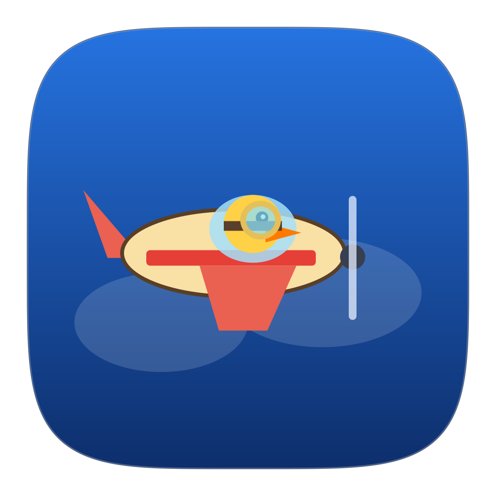

<div align="center">

# 🦆 QuakMeeting
### Multiplatform Native Flight Deck & Smart Meeting Reminder Assistant
*macOS (Sonoma / Sequoia) & Ubuntu Linux (Wayland / X11)*  
*Inspired by [QuakPit](https://github.com/Ooble-Studio/QuakPit) — Designed for Timing Precision, Travel Readiness, & 1-Click Meeting Joins.*

[](https://apple.com)
[-orange?logo=ubuntu&style=flat-square)](https://ubuntu.com)
[](https://python.org)
[](https://github.com/Antonino545/QuakMeeting/releases)
[](LICENSE)



</div>

---

## 📖 Overview & Philosophy

**QuakMeeting** is a lightweight multiplatform companion application built to solve one of the biggest productivity challenges: **forgetting upcoming video calls, missing transit leave times, or losing track of time.**

Instead of subtle system notifications that disappear in seconds, QuakMeeting animates a **mascot aircraft towing an interactive HUD banner** across your display:
- **macOS**: Built with native **AppKit / Quartz 2D** with frosted glass cards and in-process Python runtime.
- **Ubuntu Linux (Wayland & X11)**: Native **`gtk-layer-shell`** (`zwlr_layer_shell_v1` on `LAYER_OVERLAY`) and **GNOME AppIndicator3** status item.

---

## ✨ Key Features

- 🖥️ **Flight Deck Control Center (`ui/dashboard_window.py` & `ui/linux_dashboard.py`)**:
  - **📅 Today's Agenda**: Timeline of all today's events, departure times, and 1-click launch buttons.
  - **🦆 Pilot Hangar**: Interactive flight test playground for all 6 pilot mascot themes.
  - **⚙️ Preferences & Timing**: Customizable staged alert windows (e.g. 30m, 20m, 15m, 10m, 5m, 2m, 0m), starting location for Apple/Google Maps ETA, chimes, and calendar feeds.
- 🐧 **Wayland-Native Overlay Banner**: Floats above full-screen IDEs, browsers, video players, and workspaces smoothly with zero compositor restrictions.
- 🔄 **GitHub Releases Auto-Updater (`core/services/updater_service.py`)**:
  - Checks for updates automatically in the background.
  - 1-Click update and restart for both macOS (`.dmg`/`.app`) and Ubuntu (`.deb`).
- ⚡ **Multiplatform Calendar Sync**:
  - **macOS**: Native Apple EventKit API bridge (`EventKitProvider`).
  - **Ubuntu Linux**: Universal iCalendar / CalDAV engine (`CalDAVProvider`) syncing Google Calendar, iCloud, Nextcloud, and Outlook `.ics` feeds.
- 🚗 **Real-Time Travel & Departure Calculation**:
  - Automatically calculates transit and driving duration with customizable departure buffers.
  - Triggers alerts relative to **Leave Time** instead of meeting start time.
- ✈️ **7 Specialized Pilot Mascot Themes**: Automatically assigned based on event keywords.
- 🔒 **Privacy-First & Local**: No external tracking or telemetry.

---

## 📸 Visual Showcase & Multiplatform Parity

QuakMeeting delivers a unified **Catppuccin Mocha** visual experience across macOS (AppKit) and Linux (PyQt6). For complete implementation specifications, see [📐 UI Architecture & Design Tokens](docs/ARCHITECTURE.md#ui-architecture--visual-parity).

### 🦆 Pilot Hangar Playground
*Interactive test flight simulator featuring dedicated Catppuccin accent buttons for all 7 mascot pilots.*

| 🍎 macOS (Native AppKit) | 🐧 Ubuntu Linux (PyQt6 / Wayland) |
| :---: | :---: |
|  |  |

### ⚙️ Preferences & Timing Flight Deck
*Customizable staged reminder lead times (quick presets & dynamic pill chips), multi-modal routing, and calendar feeds.*

| 🍎 macOS (Native AppKit) | 🐧 Ubuntu Linux (PyQt6 / Wayland) |
| :---: | :---: |
|  |  |

---

## 🦆 Pilot Themes & Smart Classification

| Pilot Mascot | Theme | Triggers | 1-Click Action |
| :--- | :--- | :--- | :--- |
| 🦆 **Aviator Duck** | Catppuccin Green | Google Meet, Zoom, MS Teams, Webex, Online calls | `[🚀 JOIN MEETING]` |
| 👨‍🍳 **Chef Duck** | Catppuccin Peach | Dinner, Lunch, Restaurant, Pizzeria, Sushi, Aperitivo | `[🗺️ RESTAURANT MAPS]` |
| 🧑‍✈️ **Jet Captain** | Catppuccin Sapphire | Flights, Airports, High-speed trains, Buses, Transit | `[🗺️ AIRPORT / TRANSIT]` |
| 🦉 **Academic Owl** | Catppuccin Mauve | University Lectures, Exams, Campus courses, Study | `[📚 CLASSROOM & NOTES]` |
| 🏋️‍♂️ **Athlete Duck** | Catppuccin Red | Palestra, Gym, CrossFit, Padel, Tennis, Football, Sport | `[🗺️ GYM DIRECTIONS (MAPS)]` |
| 🏎️ **Speed Racer** | Catppuccin Yellow | In-person meetings, Appointments, Doctor, Dentist | `[🗺️ NAVIGATE MAPS]` |
| 🦆🌸 **Zen Duck** | Catppuccin Teal | Serenis, Therapy, Yoga, Wellness, Meditation | `[🛋️ JOIN SESSION]` |


---

## 📦 Download & Installation

### 🍎 macOS (`.dmg` Installer)
1. Download **`QuakMeeting-macOS.dmg`** from [Latest Releases](https://github.com/Antonino545/QuakMeeting/releases/latest).
2. Open the DMG and drag **QuakMeeting** into `/Applications`.
3. Launch `QuakMeeting.app` from Launchpad or Spotlight.
   > **Note on Gatekeeper**: If macOS reports the app is damaged because it was downloaded from GitHub without an Apple Developer certificate, simply run:
   > ```bash
   > xattr -cr /Applications/QuakMeeting.app
   > ```
   > *(Or right-click `QuakMeeting.app` in Finder and select **Open**).*

### 🐧 Ubuntu Linux (`.deb` Package)
1. Download **`quakmeeting_1.0.0_amd64.deb`** from [Latest Releases](https://github.com/Antonino545/QuakMeeting/releases/latest).
2. Install via terminal or Ubuntu Software:
   ```bash
   sudo apt install ./quakmeeting_1.0.0_amd64.deb
   ```
3. Launch **QuakMeeting** from your Application Grid or run `quakmeeting`.

---

## 🏗️ Project Architecture

```text
QuakMeeting/
├── main.py                        # App entry point (cross-platform dispatch)
├── build_macos_app.py             # Custom build script compiling C launcher Mach-O & bundling app (macOS)
├── scripts/
│   ├── build_ubuntu_deb.sh        # Debian/Ubuntu .deb package builder for Linux (Wayland/X11)
│   └── install_linux_deps.sh      # Installs system dependencies for Linux
├── assets/                        # App icons (PNG & ICNS), audio files
├── core/
│   ├── domain/
│   │   ├── models.py              # Meeting dataclass, PilotType, TransportMode, format_duration()
│   │   └── classifier.py          # Smart keyword matching & categorization
│   ├── providers/
│   │   ├── base.py                # BaseCalendarProvider abstract class
│   │   ├── eventkit_provider.py   # Native Apple EventKit bridge (macOS)
│   │   └── caldav_provider.py     # CalDAV calendar provider (Linux)
│   ├── services/
│   │   ├── calendar_service.py    # Synchronizes & caches Today-only events (00:00 to 23:59:59)
│   │   ├── reminder_engine.py     # Multi-stage notification triggers (evaluates leave vs start time)
│   │   ├── eta_service.py         # Apple Maps URL builder & departure time calculator
│   │   ├── arrival_service.py     # Automatic/manual arrival detection and suppression
│   │   ├── config_service.py      # Configuration manager (~/.quakmeeting/config.json)
│   │   └── event_bus.py           # Decoupled pub/sub event system
│   └── logger.py                  # Dual console & file logger (~/.quakmeeting/quakmeeting.log)
├── ui/
│   ├── app_launcher.py            # Platform-aware UI dispatcher
│   ├── common/                    # Shared UI helpers & viewmodels
│   │   ├── tray_viewmodel.py      # Status formatting & stage logic
│   │   └── banner_queue.py        # Cross-platform banner sequencing queue
│   ├── macos/                     # macOS Native UI (PyObjC, AppKit, Quartz 2D)
│   │   ├── menu_bar_app.py        # NSStatusItem status bar controller & dropdown
│   │   ├── dashboard_window.py    # Native NSWindow Flight Deck HUD
│   │   ├── dashboard_tabs/        # Native AppKit Tab Views (Agenda, Hangar, Settings)
│   │   ├── banner_window.py       # NSWindow overlay wrapper
│   │   └── banner/                # Quartz 2D animated HUD banners
│   └── linux/                     # Linux / Ubuntu UI (PyQt6, Wayland / X11)
│       ├── qt_tray_app.py         # PyQt6 QSystemTrayIcon menu & status
│       ├── qt_dashboard.py        # PyQt6 Flight Deck window
│       └── banner/                # PyQt6 animated banner overlay
└── tests/                         # Full automated unit test suite (40+ tests)
```

---

## 🛠️ Development & Building

### 1. Run Automated Unit Tests
```bash
/opt/miniconda3/bin/python3 -m unittest discover -s tests -v
```

### 2. Build macOS App & DMG
```bash
# Build macOS .app
/opt/miniconda3/bin/python3 build_macos_app.py

# Build .dmg installer
bash scripts/build_macos_dmg.sh
```

### 3. Build Ubuntu Debian Package
```bash
bash scripts/build_ubuntu_deb.sh
```

---

## ⚙️ Configuration & Customization

QuakMeeting stores all user preferences in `~/.quakmeeting/config.json`. You can edit settings directly in the **Flight Deck UI**, or customize custom keywords:

```json
{
  "meeting_reminder_stages": [20, 10, 5, 2, 0],
  "travel_reminder_stages": [45, 30, 15, 5, 0],
  "default_snooze_seconds": 120,
  "flight_speed": 3.2,
  "banner_position": "top",
  "menubar_status_mode": "countdown",
  "sound_enabled": true,
  "sound_name": "Glass",
  "home_address": "Corso Duca degli Abruzzi 24, Torino",
  "transport_mode": "transit",
  "calendar_urls": []
}
```

---

## 🤝 Credits & Acknowledgments
- Inspired by the open-source concept of [QuakPit](https://github.com/Ooble-Studio/QuakPit).
- Built with **Python 3**, **Apple AppKit/Quartz 2D** (macOS), and **gtk-layer-shell / Cairo** (Ubuntu Wayland).

