# 📐 QuakMeeting — Technical Architecture & Lifecycle

This document outlines the internal architecture, cross-platform capabilities, and data flow of QuakMeeting following a Clean Architecture design pattern.

---

## 🏗️ System Overview

QuakMeeting has been heavily refactored to fully decouple business logic from the presentation layer. The codebase is organized into two primary packages:

1. **`core/`**: Platform-agnostic business logic, data models, services, and repository layers.
2. **`ui/`**: Presentation layer containing UI components specific to macOS (Cocoa/Quartz) and Linux (Qt/Wayland/AppIndicator).

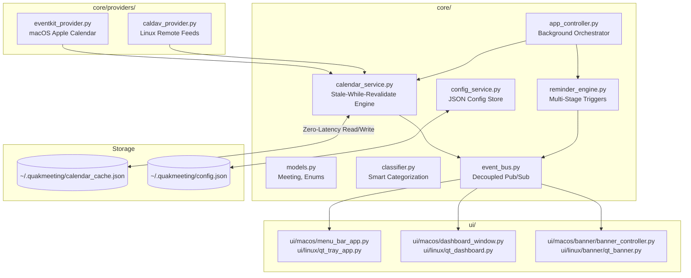

---

## 🔄 Core Architectural Layers

### 1. Domain (`core/domain/`)
Contains pure Python data classes and enums. 
- **`models.py`**: The central `Meeting` dataclass holding event info, travel metadata, and UI theme attributes. Includes logic for duration formatting and event categories (`exam`, `class`, `study`, `food`, `travel`, `sport`, etc.).
- **`classifier.py`**: Heuristic keyword and regex engine to automatically assign pilots (Duck, Captain, Chef, Owl, etc.) and categories (`exam`, `class`, `study`, `travel`, `sport`, etc.) based on event titles, metadata, and prefixes.

### 2. Providers (`core/providers/`)
Data ingestion layer fetching events from various platforms.
- **`eventkit_provider.py`**: Uses PyObjC to natively query macOS EventKit for local and synchronized calendars.
- **`caldav_provider.py`**: Standard protocol provider used primarily on Linux to fetch remote `.ics` feeds.

### 3. Services (`core/services/`)
Orchestrates business use cases.
- **`calendar_service.py`**: Filters events strictly for **Today**, performs smart multi-calendar deduplication for exams and lectures, manages the on-disk JSON cache, and enriches travel events with transit/driving ETA from home or default exam locations.
- **`reminder_engine.py`**: Evaluates when to fire notifications. It differentiates between standard events (fires relative to `start_time`) and travel events (fires relative to `departure_time`).
- **`eta_service.py`**: Calculates multi-modal travel times and builds Apple Maps / Google Maps deep links. On macOS, queries Apple's native `MKDirections` (MapKit) for live transit timetables and traffic-aware driving durations; on Linux/Ubuntu, queries open-source OpenStreetMap / OSRM routing networks (`routed-car`, `routed-bike`, `routed-foot`, and calibrated transit models) with offline Haversine fallback.
- **`event_bus.py`**: Decouples UI updates from background logic. Components publish events (e.g., `CALENDAR_UPDATED`, `CONFIG_CHANGED`) that the UI subscribes to.
- **`updater_service.py`**: Checks GitHub Releases for new releases, fetches platform packages (.dmg/.zip on macOS, .deb on Ubuntu), performs in-place upgrades, and publishes update progress events.
- **`language_service.py`**: Internationalization and localization service with OS language auto-detection (macOS `AppKit.NSLocale` & Linux `$LANG`), user language override, and centralized bilingual translations (English & Italian).
- **`sound_service.py`**: Audio and volume service managing notification chime playback with system volume and mute state detection across macOS and Linux.
- **`app_controller.py`**: The central orchestrator that launches a background thread to poll services (Calendar, Reminders) without blocking the UI main loop.

### 4. UI Layer (`ui/`)
Cross-platform presentation layer structured by operating system:
- **`ui/common/`**: Platform-independent design tokens and view logic:
  - **`theme.py`**: Central single-source-of-truth **Catppuccin Mocha** color palette (`Crust`, `Mantle`, `Base`, `Surface0/1/2`, `Text`, `Subtext0/1`, `Mauve`, `Blue`, `Sapphire`, `Green`, `Peach`, `Red`, `Yellow`, `Teal`) and pilot theme token maps.
  - **`tray_viewmodel.py`**: Shared tray status logic and countdown string formatting.
  - **`banner_queue.py`**: Cross-platform banner sequencing and queue management.
  - **`banner_speech.py`**: Animal-specific vocalization generator (`duck`, `owl`, `bunny`, `squirrel`, `platypus`) and context-aware dialogue builder.
  - **`banner_particles.py`**: Physics simulation engine for turbo afterburner flames, exhaust smoke puffs, and magical sparkles.
  - **`banner_formatting.py`**: Time differentials, countdown text, urgency flags, and travel duration formatting.
- **`ui/macos/`**: Native macOS UI using PyObjC:
  - **`theme.py`**: Native `NSColor` and `CGColor` bridges derived directly from `ui.common.theme.CatppuccinMocha`.
  - **`menu_bar_app.py`**: AppKit `NSStatusItem` menu bar controller.
  - **`dashboard_window.py`**: Native `NSWindow` Flight Deck HUD with custom segmented capsule pill switcher.
  - **`dashboard_tabs/`**: Dedicated native tab views (`agenda_tab.py`, `hangar_tab.py`, `settings_tab.py`).
  - **`banner/`**: Quartz 2D animated HUD banners:
    - `banner_view.py`: Streamlined Cocoa `NSView` managing animation timer ticks, flight motion, and mouse event dispatch.
    - `banner_layout.py`: Bounding boxes, button positions, and hit testing targets.
    - `banner_hud_painter.py`: Quartz 2D drawing routines (Glass card, pills, action buttons, towing cables, speech bubble).
    - `quiet_banner_view.py`: Distraction-free compact notifications.
    - `update_banner_view.py`: Software update alerts.
- **`ui/linux/`**: Native Linux / Ubuntu UI using PyQt6 (Wayland / X11):
  - **`theme.py`**: Native `QColor` and RGBA string converters derived directly from `ui.common.theme.CatppuccinMocha`.
  - **`qt_tray_app.py`**: PyQt6 `QSystemTrayIcon` with custom Catppuccin context menu.
  - **`qt_dashboard.py`**: PyQt6 Flight Deck window with capsule pill switcher and solid Catppuccin cards.
  - **`banner/`**: PyQt6 Wayland/X11 animated overlay banner (`qt_duck_banner.py`) and software update banners (`qt_update_banner.py`).
- **`ui/app_launcher.py`**: Platform-aware UI dispatcher and entrypoint.

---

## 🎨 UI Architecture & Visual Parity

The UI follows strict multiplatform parity where both macOS AppKit and Linux PyQt6 render pixel-harmonious layouts, cards, buttons, and badges based on the common Catppuccin Mocha theme.

### 📸 Visual Comparison: macOS (AppKit) vs Linux (PyQt6)

#### 1. 📅 Today's Agenda Tab
*Meeting countdowns, multi-modal travel leave times, and 1-click launch / navigation actions.*

| macOS (AppKit) | Linux (PyQt6) |
| :---: | :---: |
| 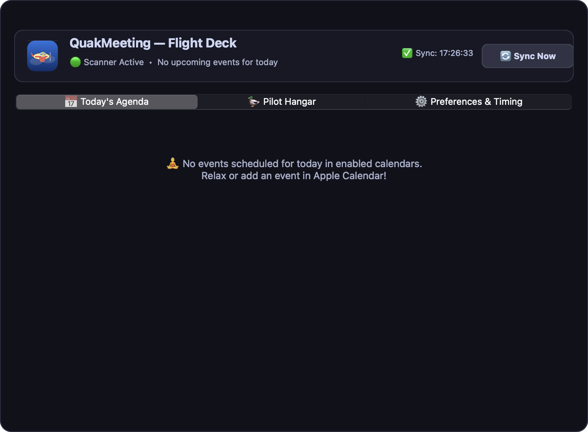 | 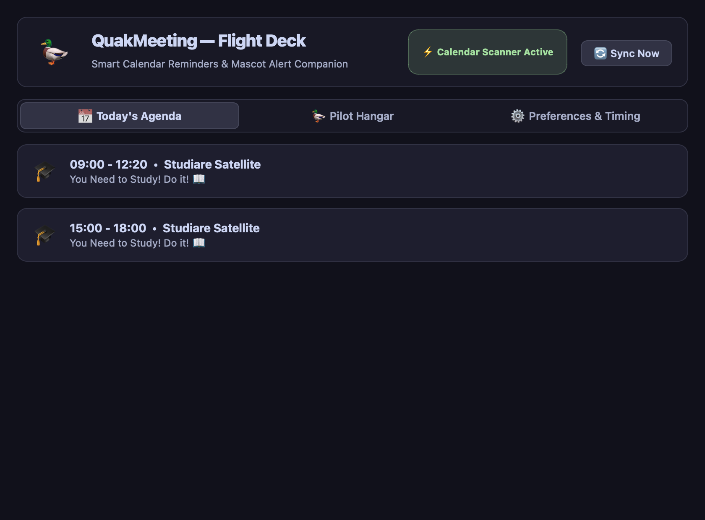 |

#### 2. 🦆 Pilot Hangar Tab
*Interactive mascot flight testing with pilot-specific Catppuccin accent buttons.*

| macOS (AppKit) | Linux (PyQt6) |
| :---: | :---: |
| 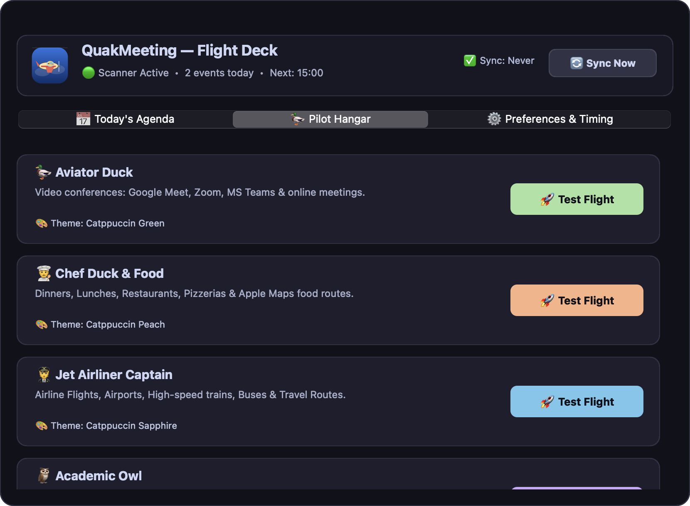 | 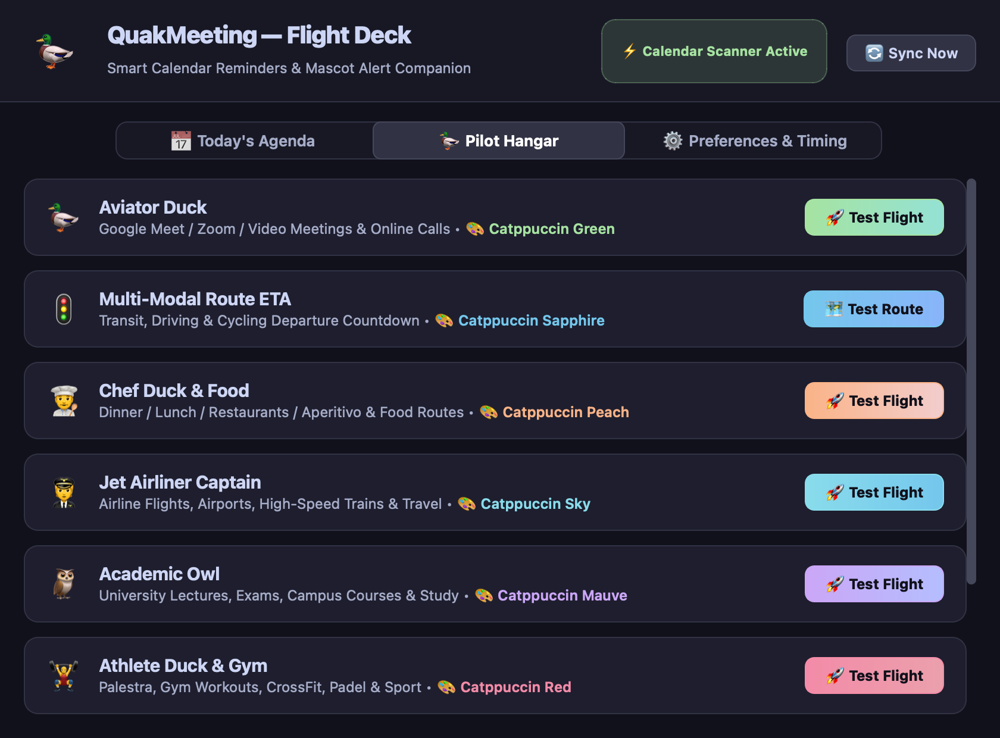 |

#### 3. ⚙️ Preferences & Timing Tab
*Modern pill chips for reminder lead times, transport mode switcher, sound selection, and calendar toggles.*

| macOS (AppKit) | Linux (PyQt6) |
| :---: | :---: |
| 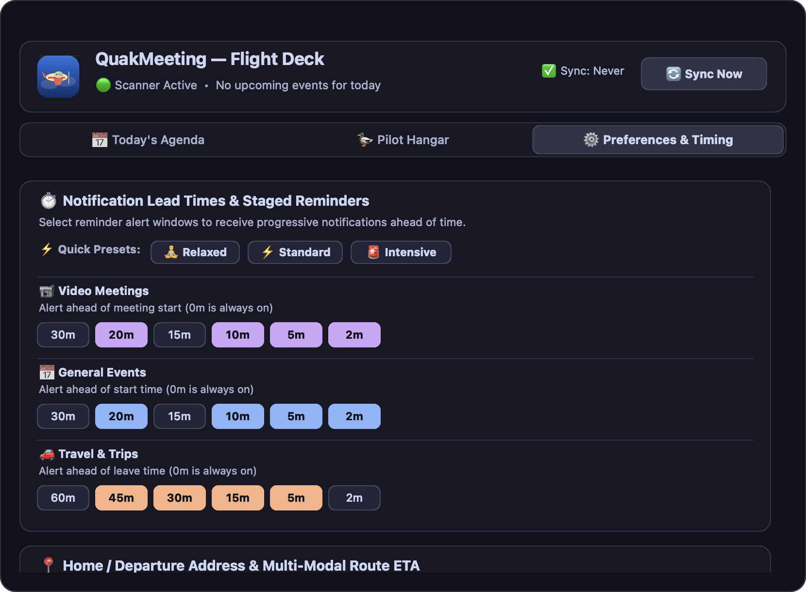 | 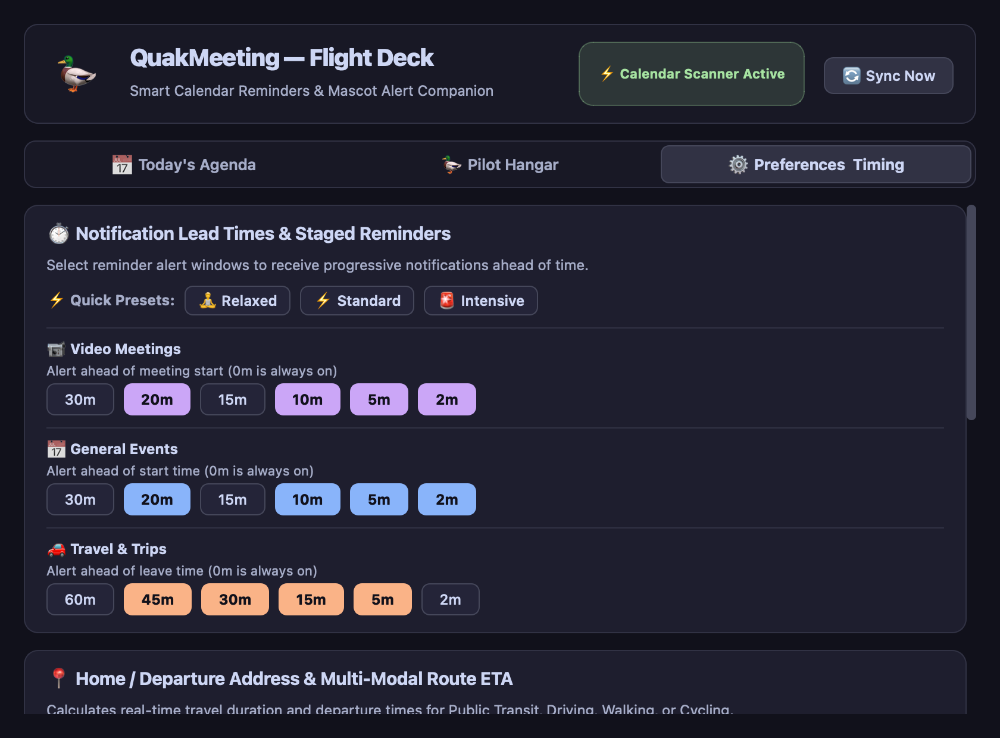 |

#### 4. 🚀 Software Update Banner & In-Banner Upgrader
*Cross-platform animated update notification with dynamic neon sweep border, live download/installation progress tracking, and automatic relaunch.*

| macOS (AppKit) — Update Prompt | Linux (PyQt6) — Update Prompt |
| :---: | :---: |
| 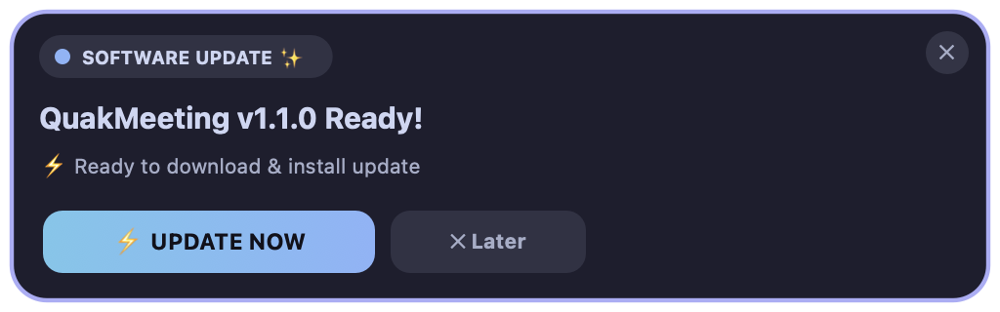 | 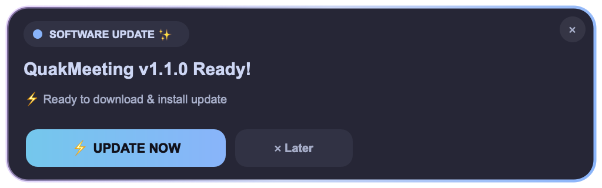 |

| macOS (AppKit) — Live Downloading Progress | macOS (AppKit) — Installation Complete & Relaunch |
| :---: | :---: |
| 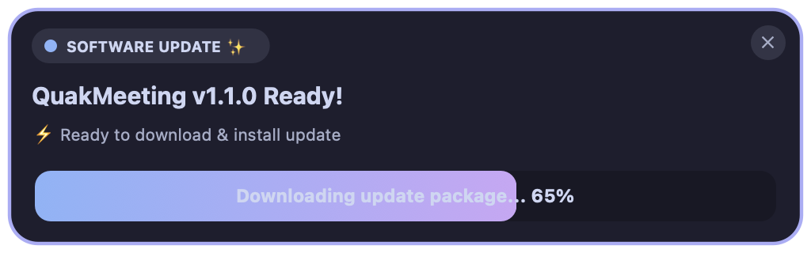 | 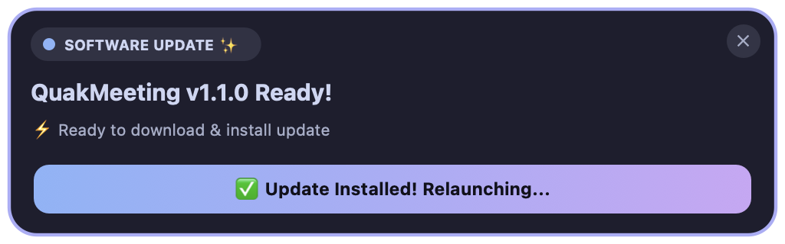 |

---

## ⚙️ Lifecycle & Threading Model

### 1. Zero-Latency Caching (Stale-While-Revalidate)
Querying calendars (especially via EventKit) can be slow. 
- On launch or UI interaction, `calendar_service.py` immediately reads `~/.quakmeeting/calendar_cache.json` to instantly populate the UI.
- `app_controller.py` polls `CalendarService.sync_now()` in the background every 30-60 seconds.
- When fresh data is retrieved, the disk cache is atomically replaced, and a `CALENDAR_UPDATED` event is fired over the `event_bus`, causing the UI to gracefully refresh.

### 2. In-Place Automatic Update Lifecycle
- `updater_service.py` checks GitHub Releases in the background.
- When a new version is released, it publishes `TRIGGER_BANNER` with `is_update_banner: True`.
- On both macOS and Linux, the update banner slides onto the screen with a rotating Blue-to-Mauve gradient border.
- Clicking **`⚡ UPDATE NOW`** switches into active installation mode:
  1. Downloads release asset while publishing `UPDATE_PROGRESS` events.
  2. Replaces `/Applications/QuakMeeting.app` (macOS) or installs via `dpkg` (Linux).
  3. Displays `✅ Update Installed! Relaunching...` and smoothly relaunches the application.

### 3. Application Entry & Loop (`main.py`)
- `main.py` detects the platform (`sys.platform`).
- Starts the `AppController` background loop.
- Initializes the specific UI loop (`NSApplication.sharedApplication().run()` for macOS or `QApplication.exec()` for Linux).
- Note: On macOS, the application requires the `build_macos_app.py` Mach-O launcher to properly associate the process as an `.app` bundle, enabling the top menu bar to render correctly.

