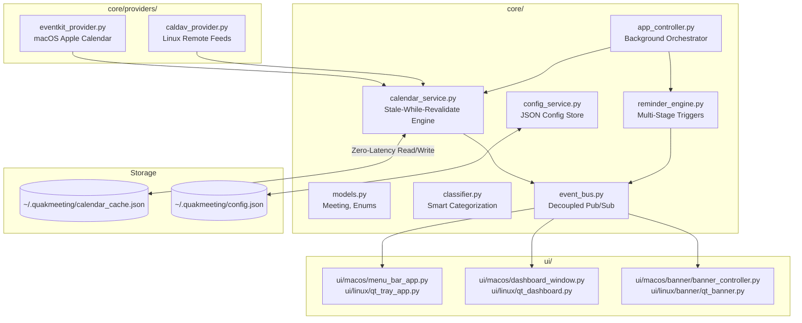

# 📐 QuakMeeting — Technical Architecture & Lifecycle

This document outlines the internal architecture, cross-platform capabilities, and data flow of QuakMeeting following a Clean Architecture design pattern.

---

## 🏗️ System Overview

QuakMeeting has been heavily refactored to fully decouple business logic from the presentation layer. The codebase is organized into two primary packages:

1. **`core/`**: Platform-agnostic business logic, data models, services, and repository layers.
2. **`ui/`**: Presentation layer containing UI components specific to macOS (Cocoa/Quartz) and Linux/Windows (PyQt6).

---

## 🔄 Core Architectural Layers

### 1. Domain (`core/domain/`)
Contains pure Python data classes, value objects, and domain policies decoupled from PyObjC, PyQt, and external frameworks.
- **`models.py`**: The central **`CalendarEvent`** entity (with full backward-compatible **`Meeting`** and **`Event`** aliases). Composes dedicated domain value objects:
  - **`EventTime`**: UTC-normalized start/end timestamps, all-day flag, duration, and temporal checks (`duration_minutes`, `is_upcoming`, `is_past`).
  - **`Location`**: Venue address, classroom, teacher, origin address, and location predicates (`has_location`).
  - **`MeetingLink`**: Video conferencing or telemedicine URLs and action URLs (`is_online`).
  - **`TravelPlan`**: Transit metadata, departure time, travel ETA minutes, distance in km, transport mode, and formatted ETA text.
  - **`PresenceStatus`**: Active presence tracking, venue Wi-Fi connection, and call detection (`is_arrived`, `arrival_reason`, `is_quiet_reminder`).
  - **`EventPresentation`**: Mascot pilot styling tokens, Catppuccin theme names, action button labels, mascot outfit customization, and an optional persisted accessory list with legacy outfit compatibility.
- **`clock.py`**: Injectable `Clock` protocol with `SystemClock` for production and controllable `FakeClock` for deterministic simulation and time-warp testing.
- **`state_machine.py`**: Deterministic event lifecycle state machine (`EventState` enum: `UPCOMING → PREPARE → TIME_TO_LEAVE → ARRIVING → ARRIVED → ACTIVE → COMPLETED`, plus `CANCELLED`, `DISMISSED`) with automatic state transition resolution.
- **`reminder_policy.py`**: Category-specific reminder policies (`ExamReminderPolicy`, `LectureReminderPolicy`, `VideoMeetingReminderPolicy`, `TransitReminderPolicy`, `GeneralReminderPolicy`) managed via `ReminderPolicyRegistry` with adaptive presence suppression.
- **`context_engine.py`**: The Context Engine & "Why?" Transparency authority. Evaluates real-time schedules, transit ETA buffers, user presence signals (Wi-Fi, active call processes), and time horizons to generate immediate transition guidance (`ActionType`: `LEAVE_NOW`, `PREPARE_DEPARTURE`, `JOIN_CALL`, `HEAD_TO_CLASS`, `ACTIVE_SESSION`, `RELAX`, `UserContextState`) with human-readable rationale (e.g., "Leave now: 18m transit + 10m buffer for 09:00 Lecture").
- **`capabilities.py`**: Boolean capability model (`EventCapabilities`: `can_join`, `can_navigate`, `has_location`, `needs_travel`, `can_snooze`, `show_arrival_badge`, `show_in_call_badge`).
- **`classifier.py`**: Heuristic keyword, regex, and temporal anchor engine to automatically assign pilots (Duck, Captain, Chef, Owl, etc.) and categories (`exam`, `class`, `study`, `food`, `travel`, `sport`, `in_person`, `health`, etc.) based on event titles, metadata, closed-vocabulary prefixes, idiom overrides, and iterative temporal anchor masking. Extracts video meeting and telemedicine URLs across Google Meet, Zoom, Microsoft Teams, Cisco Webex, Jitsi Meet, Whereby, GoToMeeting, Skype, Discord, Slack Huddle, and Serenis.

The shared `ui/common/mascot_catalog.py` defines the cross-platform Hangar animal IDs and reusable accessory IDs. Legacy `outfit` values remain valid and are normalized into accessory layers, while new selections may persist an `accessories` list. Renderers compose these layers as `Animal → Outfit → Accessories → Effects` on both macOS Quartz and Linux/Windows Qt paths.

### 2. Providers (`core/providers/`)
Data ingestion layer fetching events from various platforms.
- **`eventkit_provider.py`**: Uses PyObjC to natively query macOS EventKit for local and synchronized calendars.
- **`eds_provider.py`**: Queries GNOME Evolution Data Server (EDS) for system calendars on Linux.
- **`caldav_provider.py`**: Pure Python calendar provider used on Windows and Linux to synchronize remote `.ics` feeds, CalDAV endpoints, and local calendar files. Features intelligent Today-only recurring `RRULE` expansion (`FREQ=DAILY/WEEKLY/MONTHLY`, `INTERVAL`, `BYDAY`, `UNTIL`, `COUNT`, `EXDATE`), timezone resolution via `TZID` and Python stdlib `zoneinfo.ZoneInfo`, and persistent in-memory/fallback caching for remote feeds.

### 3. Services (`core/services/`)
Orchestrates business use cases.
- **`database_service.py`**: Centralized SQLite state storage (`~/.quakmeeting/quakmeeting.db`). Replaces legacy separate JSON files with ACID transactions, WAL mode, foreign keys, and transparent migration. Manages tables for `events`, `notified_stages`, `banner_history`, `eta_cache`, and `address_cache`, with automatic `:memory:` fallback when running in sandboxed test suites.
- **`notification_service.py`**: Unified `NotificationProvider` architecture. Standardizes notification delivery across `MascotBannerProvider` (animated floating mascot banners), `SystemNotificationProvider` (native OS desktop notification fallback via AppleScript/osascript on macOS, notify-send on Linux, and PowerShell toast on Windows), `SoundNotificationProvider` (audio chime playback), and `CompositeNotificationProvider` with automatic fallback.
- **`calendar_service.py`**: Filters events strictly for **Today**, performs smart multi-calendar deduplication for exams and lectures, manages the state database via `MeetingRepository`, and enriches travel events with transit/driving ETA from home or default exam locations. Automatically selects EventKit on macOS, EDS on GNOME/Linux, and CalDAV on Windows.
- **`reminder_engine.py`**: Evaluates when to fire notifications. Integrates with `ReminderPolicyRegistry` and `NotificationService`, dispatching multi-stage notifications relative to `start_time` for standard events or `departure_time` for travel events.
- **`state_store.py`**: Backward-compatible persistence facades (`NotifiedStateStore`, `BannerHistoryStore`) delegating directly to `DatabaseService`.
- **`arrival_service.py`**: Automatic presence detection and arrival suppression engine across macOS (`airport`), Linux (`nmcli`/`iwgetid`), and Windows (`netsh`). Detects active video call processes (Zoom, Microsoft Teams, Webex, Skype, Slack) and matches current Wi-Fi against customizable venue SSIDs (Eduroam, university campus, office), providing live presence diagnostics to the UI.
- **`address_service.py`**: Centralized address search, live autocomplete, and geocoding validation authority querying OpenStreetMap Nominatim with Photon fallback, proximity-biased coordinate bounding boxes, shared disk/memory caching (`address_cache.json`), and platform map deep links.
- **`eta_service.py`**: Calculates multi-modal travel times and builds Apple Maps / Google Maps deep links. Delegates address geocoding to `address_service` with unified disk caching. Features Smart Auto-Transport Mode (automatically calculates and suggests walking route ETA when destination is within `< 1.2 km` or configured threshold). On macOS, queries Apple's native `MKDirections` (MapKit) for live transit timetables and traffic-aware driving durations; on Linux and Windows, queries open-source OpenStreetMap / OSRM routing networks (`routed-car`, `routed-bike`, `routed-foot`, and calibrated transit models) with offline Haversine fallback.
- **`event_bus.py`**: Decouples UI updates from background logic. Components publish events (e.g., `CALENDAR_UPDATED`, `CONFIG_CHANGED`) that the UI subscribes to.
- **`updater_service.py`**: Checks GitHub Releases for new releases, fetches platform packages (.dmg/.zip on macOS, .deb on Ubuntu, .exe/.zip on Windows), performs in-place upgrades, and publishes update progress events.
- **`language_service.py`**: Internationalization and localization service with OS language auto-detection (macOS `AppKit.NSLocale`, Linux `$LANG`, Windows locale), user language override, and centralized bilingual translations (English & Italian).
- **`sound_service.py`**: Audio and volume service managing notification chime playback with system volume and mute state detection across macOS (`afplay`), Linux (`canberra-gtk-play`/`pw-play`), and Windows (`winsound`).
- **`autostart.py`**: Launch-at-login manager supporting macOS SMAppService & LaunchAgent, Linux XDG `.desktop` entries, and Windows Registry (`HKCU\Software\Microsoft\Windows\CurrentVersion\Run`).
- **`diagnostics.py`**: Pre-flight and runtime system health inspector (Python runtime, window server, calendar providers, presence status, audio devices, and storage paths) with structured diagnostics data and formatted CLI (`--check`) reporting.
- **`app_controller.py`**: The central orchestrator that launches a background thread to poll services (Calendar, Reminders) without blocking the UI main loop.

### 4. UI Layer (`ui/`)
Cross-platform presentation layer structured by operating system:
- **`ui/macos/components/`**: Reusable AppKit components:
  - **`layout.py`**: Qt-style declarative relative layout helpers (`VBox`, `HBox` wrapping `NSStackView`) providing `add_widget()`, `add_widgets()`, `add_stretch()`, `set_spacing()`, and padding.
  - **`address_autocomplete_view.py`**: Generic `NSView` providing debounced keystroke search (350ms), floating suggestions window (`NonActivatingSuggestionsWindow`), verification status badges (`🟢 Verified`), and manual check button.
  - **`button.py`**: Layer-backed `ModernButton` with pointing hand cursor, hover feedback, tactile click animation, and clean empty-title initialization.
  - **`toggle_switch.py`**: Tactile spring-animated `ModernToggleSwitch` supporting immediate `mouseDown_` response, state tracking, and first-mouse window activation.
- **`ui/linux/components/`**: Reusable PyQt6 components:
  - **`address_autocomplete_widget.py`**: Generic `QWidget` providing debounced `QTimer` search, popup `QListWidget` suggestions, canonical address badges, and browser map preview links.
- **`ui/common/`**: Platform-independent design tokens and view logic:
  - **`theme.py`**: Central single-source-of-truth **Catppuccin Mocha** color palette (`Crust`, `Mantle`, `Base`, `Surface0/1/2`, `Text`, `Subtext0/1`, `Mauve`, `Blue`, `Sapphire`, `Green`, `Peach`, `Red`, `Yellow`, `Teal`) and pilot theme token maps.
  - **`tray_viewmodel.py`**: Shared tray status logic and countdown string formatting.
  - **`agenda_viewmodel.py`**: Shared presentation models (`AgendaEventVM`) and ViewModel builder decoupling desktop views from domain models.
  - **`banner_queue.py`**: Cross-platform banner sequencing and queue management.
  - **`banner_speech.py`**: Animal-specific vocalization generator (`duck`, `owl`, `bunny`, `squirrel`, `platypus`) and context-aware dialogue builder.
  - **`banner_particles.py`**: Physics simulation engine for turbo afterburner flames, exhaust smoke puffs, magical sparkles, dynamic flight pitch & thrust calculation (`compute_airplane_flight_dynamics`), and rotated towing cable hook anchors (`compute_towing_cable_hooks`).
  - **`banner_formatting.py`**: Time differentials, countdown text, urgency flags, and travel duration formatting.
  - **`banner_presets.py`**: Platform-independent mock meeting payloads for mascot test flights and software update banners.
  - **`mascot_catalog.py`**: Shared Hangar catalog for mascot labels, accessory IDs, and backward-compatible accessory normalization.
- **`ui/macos/`**: Native macOS UI using PyObjC:
  - **`theme.py`**: Native `NSColor` and `CGColor` bridges derived directly from `ui.common.theme.CatppuccinMocha`.
  - **`menu_bar_app.py`**: AppKit `NSStatusItem` menu bar controller.
  - **`dashboard_window.py`**: Native `NSWindow` Flight Deck HUD with custom segmented capsule pill switcher.
  - **`dashboard_tabs/`**: Dedicated native tab views:
    - `agenda_tab.py`: Today's Command Center (NOW Hero Card with "Why?" transparency box, NEXT primary upcoming event with 1-click launch, LATER timeline agenda, and EARLIER TODAY concluded events section).
    - `hangar_tab.py`: Hangar pilot selection, personality traits, and test flights.
    - `settings_tab.py`: High-level coordinator featuring a modern Two-Pane Sidebar Navigation layout (Left: Category navigation sidebar; Right: Dedicated card scroll pane).
    - `settings/`: Decomposed sub-card controllers (`timing_card.py`, `eta_card.py`, `arrival_card.py`, `calendars_card.py`, `system_card.py`, `helpers.py`).
  - **`banner/`**: Quartz 2D animated HUD banners:
    - `banner_view.py`: Streamlined Cocoa `NSView` managing animation timer ticks, dynamic airplane pitch rotation transforms, flight motion, and mouse event dispatch.
    - `banner_layout.py`: Bounding boxes, button positions, and hit testing targets.
    - `banner_hud_painter.py`: Quartz 2D drawing routines (Glass card, pills, action buttons, vibrating towing cables, speech bubble).
    - `quiet_banner_view.py`: Distraction-free compact notifications.
    - `renderers/`: Vector pilot & vehicle renderers (`duck_renderer.py`, `modular_renderer.py`) featuring 4-blade high-RPM propeller discs, pulsating wingtip strobe beacons, natural mascot eye blinking, head bobbing, and species-specific slipstream inertia.
- **`ui/linux/`**: Native Linux / Ubuntu UI using PyQt6 (Wayland / X11):
  - **`theme.py`**: Native `QColor` and RGBA string converters derived directly from `ui.common.theme.CatppuccinMocha`.
  - **`qt_tray_app.py`**: PyQt6 `QSystemTrayIcon` with custom Catppuccin context menu.
  - **`qt_dashboard.py`**: PyQt6 Flight Deck window coordinator with capsule pill switcher and window lifecycle management.
  - **`dashboard_tabs/`**: Dedicated modular tab views matching macOS:
    - `agenda_tab.py`: Today's Command Center (NOW Hero Card with "Why?" transparency box, NEXT primary upcoming event, LATER timeline agenda, and EARLIER TODAY concluded events section with arrival badges `[✅ Arrived]`, `[🟢 In Call]`, `[📍 On Site]`).
    - `hangar_tab.py`: Hangar pilot selection and test flight controls.
    - `settings_tab.py`: High-level coordinator featuring a modern Two-Pane Sidebar Navigation layout (Left: Category navigation sidebar; Right: Dedicated card scroll pane).
    - `settings/`: Decomposed sub-card widgets (`timing_card.py`, `eta_card.py`, `arrival_card.py`, `calendars_card.py`, `system_card.py`).
  - **`banner/`**: PyQt6 Wayland/X11 animated overlay banner (`qt_duck_banner.py`) with dynamic pitch rotation and software update banners (`qt_update_banner.py`), managed via `qt_banner.py` and a dedicated XCB helper process (`qt_banner_helper.py`) for Wayland environments.
  - **`banner/renderers/`**: Pixel-identical PyQt6 vector renderers with multiplatform parity to macOS Quartz 2D.
- **`ui/app_launcher.py`**: Platform-aware UI dispatcher and entrypoint.

---

## 🎨 UI Architecture & Visual Parity

The UI follows strict multiplatform parity where both macOS AppKit and Linux PyQt6 render pixel-harmonious layouts, cards, buttons, and badges based on the common Catppuccin Mocha theme.

### 📸 Visual Comparison: macOS (AppKit) vs Linux (PyQt6)

#### 1. 📅 Today's Agenda Tab
*Meeting countdowns, multi-modal travel leave times, and 1-click launch / navigation actions.*

| macOS (AppKit) | Linux (PyQt6) |
| :---: | :---: |
|  |  |

#### 2. 🦆 Pilot Hangar Tab
*Interactive mascot flight testing with pilot-specific Catppuccin accent buttons, live vector animations, and in-card trigger keyword management for all event categories. Includes the **Academic Master Card** with unified macro-presentation and 3 dedicated subcategories (📖 Self-Study, 🏫 Classes & Lectures, 🎓 Exams & Finals) featuring contextual explainer guides, independent mascot selectors, tailored keyword chips, and live simulation buttons.*

| macOS (AppKit) | Linux (PyQt6) |
| :---: | :---: |
|  |  |

#### 3. ⚙️ Preferences & Timing Tab
*Modern pill chips for reminder lead times, transport mode switcher, sound selection, and calendar toggles. Features the unified **Route & Navigation** card with transit-line connector graphics (Sapphire origin dot, Mauve destination dot, vertical rule), dual-state editing/confirmed address components with zero-overlap floating search overlays, connected zero-gap segmented transport controls, and dynamic contextual departure buffer hints.*

| macOS (AppKit) | Linux (PyQt6) |
| :---: | :---: |
|  |  |

#### 4. 🚀 Software Update Banner & In-Banner Upgrader
*Cross-platform animated update notification with dynamic neon sweep border, live download/installation progress tracking, and automatic relaunch.*

| macOS (AppKit) — Update Prompt | Linux (PyQt6) — Update Prompt |
| :---: | :---: |
|  |  |

| macOS (AppKit) — Live Downloading Progress | macOS (AppKit) — Installation Complete & Relaunch |
| :---: | :---: |
|  |  |

#### 5. 🦆 Advance Flyby Reminder vs. Event-Time Looping Banner
QuakMeeting provides clear visual and functional distinction between advance heads-up reminders and event-time alarms:
- **Advance Flyby Reminder (`reminder_stage > 0`, e.g., 20m, 10m, 5m, 2m)**:
  - Single-pass non-looping flight across the screen that auto-dismisses upon exiting the display.
  - Distinctive `[✈️ FLYBY]` / `[✈️ AL VOLO]` badge pill and soft Lavender accent border (`Theme.LAVENDER`).
  - Contextual flyby speech quotes across all mascots (e.g., *"Quak! Heads up! Just flying by! 🦆✈️"*).
  - **Adaptive Slim Height (`96px`)**: For buttonless general event reminders (advance reminders with no online meeting URL or transit link), the banner card dynamically shrinks from `132px` to `96px`. This completely eliminates bottom whitespace while keeping symmetrical 18px content padding, with towing cables and the pilot plane automatically re-centering.
  - **Zero bottom buttons for general events**: Since the reminder engine automatically re-alerts at subsequent stages (e.g., 5m, 2m), manual snooze is redundant. The card serves as a pure ambient heads-up widget without buttons prompting unnecessary clicks.
  - **Single `[🚀 Join Meeting]` button for online meetings**: Retained at standard `132px` height so users can enter calls early with 1 click, without redundant snooze or skip controls.
  - **`[📍 I'm Here]` button for travel events**: Retained at standard `132px` height when transit destinations have location/maps links to allow early arrival acknowledgement (paired with `[🗺️ Directions]` when a directions URL is available).
- **Event-Time Looping Banner (`reminder_stage == 0`)**:
  - Persistent alert looping across the screen at standard `132px` height until acknowledged by the user.
  - High-visibility styling and urgent countdown pill (`⏳ Starting Now!` / `⏳ Inizia ora!`).
  - Minimalist, high-contrast action bar: single primary action (`[🚀 Join Meeting]` for online events, `[📍 I'm Here]` for in-person travel events, or `[✅ Got it]` for general events) avoids visual clutter and ensures maximum readability.
- **Interactive Keyboard & Mascot Controls (Both macOS & Linux)**:
  - **Instant `Esc` Dismissal**: Pressing the `Escape` key immediately dismisses any active flying banner via Qt `QShortcut` / `keyPressEvent` on Linux and `NSEvent` monitor / `keyDown_` on macOS.
  - **Playful Mascot Hover Reaction**: Hovering the cursor over the pilot mascot airplane pauses flight progression and triggers an animal-specific playful speech quote (e.g., *"Quak! Hover mode engaged! 🛸"*, *"Uhu! Osservo dall'alto! 🦉✨"*), smoothly restoring the normal reminder speech when the mouse leaves.

---

## ⚙️ Lifecycle & Threading Model

### 1. Zero-Latency Caching (Stale-While-Revalidate)
Querying calendars (especially via EventKit on macOS or EDS on Linux) can be slow. 
- On launch or UI interaction, `calendar_service.py` immediately reads `~/.quakmeeting/calendar_cache.json` to instantly populate the UI.
- On Linux, `EDSCalendarProvider` connects to uncached calendar sources concurrently using a worker pool and caches connected `ECal.Client` handles, cutting sync time from over 12 seconds to sub-second (< 0.05s on repeat).
- Initial and periodic calendar syncs run in guarded daemon workers (`_schedule_background_sync`), eliminating concurrent worker collisions and startup delays.
- `app_controller.py` polls `CalendarService.get_upcoming_meetings()` in the background every 15-30 seconds.
- When fresh data is retrieved, the disk cache is atomically replaced, and a `CALENDAR_SYNCED` event is published over the `event_bus` to automatically refresh the tray menu, menubar icon, and active Flight Deck windows (updating the agenda and stopping the sync spinner).
- If a provider refresh fails, the service keeps or reloads the last valid cache, publishes it to the UI, and waits for the normal cache interval before retrying.
- Linux settings calendar metadata is loaded off the Qt main thread and delivered through a Qt signal; provider and parsing work must never block dashboard construction.

On Linux Wayland sessions, Qt uses the native Wayland platform by default. Set `QUAKMEETING_QT_XCB=1` only when an XCB/XWayland compatibility fallback is required.

### 2. In-Place Automatic Update Lifecycle
- `updater_service.py` checks GitHub Releases in the background (startup/periodic) or on demand (`manual=True`).
- When a new version is released, it publishes `TRIGGER_BANNER` with `is_update_banner: True` and `is_up_to_date: False`.
- On manual check when already up to date, it publishes `TRIGGER_BANNER` with `is_update_banner: True` and `is_up_to_date: True`.
- On both macOS and Linux, the modular update banner slides onto the screen:
  - If an update is available: rotating Blue-to-Mauve gradient sweep border, "⚡ UPDATE NOW" button, and "✕ Later" postpone button.
  - If already up to date: Catppuccin Green-to-Teal accent border, "You're Up to Date! ✨", and a single "✓ Great" confirmation button with auto-dismiss.
- Clicking **`⚡ UPDATE NOW`** switches into active installation mode:
  1. Downloads release asset while publishing `UPDATE_PROGRESS` events.
  2. Replaces `/Applications/QuakMeeting.app` (macOS) or installs via `dpkg` (Linux).
  3. Displays `✅ Update Installed! Relaunching...` and smoothly relaunches the application.

### 3. Application Entry & Loop (`main.py`)
- `main.py` detects the platform (`sys.platform`).
- Starts the `AppController` background loop.
- Initializes the specific UI loop (`NSApplication.sharedApplication().run()` for macOS or `QApplication.exec()` for Linux).
- Note: On macOS, the application requires the `build_macos_app.py` Mach-O launcher to properly associate the process as an `.app` bundle, enabling the top menu bar to render correctly.

### 4. Linux Startup Lifecycle
The Linux launcher keeps the first Qt paint independent from calendar and network availability:

1. `main.py` preserves the native Qt platform selected by the session. `QUAKMEETING_QT_XCB=1` is the explicit XCB compatibility override.
2. `run_qt_tray_app()` creates the Qt application and tray shell. Tray data is cache-first.
3. The Flight Deck creates its header, navigation, and agenda placeholder immediately. Hangar and Settings are initialized after the first event-loop turn.
4. Agenda refresh reads the local cache and displays meetings, an empty state, or a retryable error state. Arrival/presence checks are not part of the first paint.
5. UI subscriptions are installed before `AppController.start_background_loop()` so reminder events cannot be recorded before their UI handlers exist.
6. The first updater check is queued after the first Qt event-loop turn. Calendar provider discovery and synchronization run through the guarded calendar worker; Linux EDS probing is never performed during service import.
7. A dashboard construction failure is logged and shown in a retryable Flight Deck error window while the tray remains usable.

Notification banners are the exception to the native Wayland UI: when the main Qt application reports a Wayland platform, `show_qt_banner()` starts a short-lived helper process with `QT_QPA_PLATFORM=xcb`. This preserves the banner's animated top-level movement without changing the dashboard's platform.

The controller owns one idempotent polling loop. Startup work must be cache-first, guarded against overlapping calendar workers, and delivered back to Qt through the existing event bus/signals.

