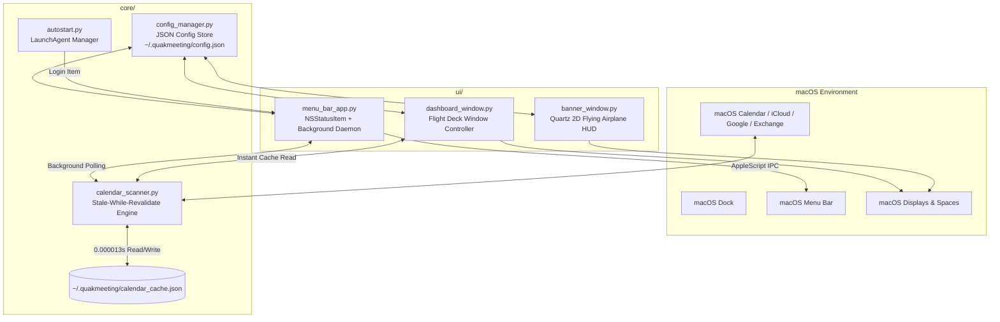

# 📐 QuakMeeting — Technical Architecture & Lifecycle

This document outlines the internal architecture, threading model, memory lifecycle, and data flow of QuakMeeting.

---

## 🏗️ System Overview

---

## 🔄 Lifecycle & Threading Model

### 1. Zero-Latency Stale-While-Revalidate Sync
- **The Challenge**: Direct AppleScript queries to `Calendar.app` can take 15–30 seconds if the user has multiple synchronized accounts with recurring events.
- **The Solution**: 
  - On launch or UI open, `calendar_scanner.py` immediately reads `~/.quakmeeting/calendar_cache.json` in **$0.000013\text{ seconds}$**.
  - A background daemon thread periodically queries `Calendar.app` without blocking the main event loop (`NSApplication`).
  - When fresh data arrives, it atomically replaces the in-memory cache, writes to disk, and signals the main thread to refresh the UI.

### 2. Window & Application Lifecycle
- `QuakMeetingAppDelegate` implements `applicationShouldTerminateAfterLastWindowClosed_` returning `False`.
- Both `dashboard_window.py` and `banner_window.py` set `window.setReleasedWhenClosed_(False)`.
- When the user closes $(✕)$ the Flight Deck or dismisses a flying banner, the window is simply hidden (`orderOut_`), allowing the background scanner and menu bar to run 24/7.

---

## 🎨 Rendering Engine (`ui/banner_window.py`)
- **Graphics Pipeline**: Native Apple Quartz 2D (`NSBezierPath`, `CGContext`, `NSColor`, `NSFont`).
- **Animation Loop**: 60 FPS `NSTimer` calculating smooth sinusoidal bobbing (`sin(t * 5.0)`), propeller rotation, and dynamic wind trail particles.
- **Multi-Monitor & Fullscreen Compatibility**: Uses `NSWindowCollectionBehaviorCanJoinAllSpaces | NSWindowCollectionBehaviorFullScreenAuxiliary` with `NSStatusWindowLevel` so banners float above fullscreen games, videos, and IDEs.
