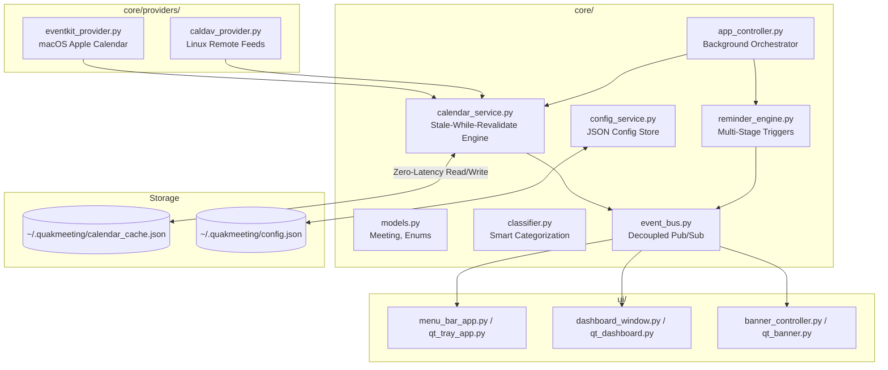

# 📐 QuakMeeting — Technical Architecture & Lifecycle

This document outlines the internal architecture, cross-platform capabilities, and data flow of QuakMeeting following a Clean Architecture design pattern.

---

## 🏗️ System Overview

QuakMeeting has been heavily refactored to fully decouple business logic from the presentation layer. The codebase is organized into two primary packages:

1. **`core/`**: Platform-agnostic business logic, data models, services, and repository layers.
2. **`ui/`**: Presentation layer containing UI components specific to macOS (Cocoa/Quartz) and Linux (Qt/Wayland/AppIndicator).

---

## 🔄 Core Architectural Layers

### 1. Domain (`core/domain/`)
Contains pure Python data classes and enums. 
- **`models.py`**: The central `Meeting` dataclass holding event info, travel metadata, and UI theme attributes. Includes logic for duration formatting.
- **`classifier.py`**: Heuristic keyword matching engine to automatically assign pilots (Duck, Captain, Chef, etc.) and categories based on event titles.

### 2. Providers (`core/providers/`)
Data ingestion layer fetching events from various platforms.
- **`eventkit_provider.py`**: Uses PyObjC to natively query macOS EventKit for local and synchronized calendars.
- **`caldav_provider.py`**: Standard protocol provider used primarily on Linux to fetch remote `.ics` feeds.

### 3. Services (`core/services/`)
Orchestrates business use cases.
- **`calendar_service.py`**: Filters events strictly for **Today**, manages the on-disk JSON cache, and implements the stale-while-revalidate pattern.
- **`reminder_engine.py`**: Evaluates when to fire notifications. It differentiates between standard events (fires relative to `start_time`) and travel events (fires relative to `departure_time`).
- **`eta_service.py`**: Handles routing links (e.g. Apple Maps) and calculates transit/walking buffers.
- **`event_bus.py`**: Decouples UI updates from background logic. Components publish events (e.g., `CALENDAR_UPDATED`, `CONFIG_CHANGED`) that the UI subscribes to.
- **`app_controller.py`**: The central orchestrator that launches a background thread to poll services (Calendar, Reminders) without blocking the UI main loop.

### 4. UI Layer (`ui/`)
Cross-platform presentation layer.
- **macOS Native**: Uses PyObjC for `menu_bar_app.py` (NSStatusItem) and Quartz 2D for `banner_window.py` (highly performant animated HUD).
- **Linux Native**: Uses PyQt6 for `qt_dashboard.py`, `qt_tray_app.py`, and Wayland-compatible notifications.

---

## ⚙️ Lifecycle & Threading Model

### 1. Zero-Latency Caching (Stale-While-Revalidate)
Querying calendars (especially via EventKit) can be slow. 
- On launch or UI interaction, `calendar_service.py` immediately reads `~/.quakmeeting/calendar_cache.json` to instantly populate the UI.
- `app_controller.py` polls `CalendarService.sync_now()` in the background every 30-60 seconds.
- When fresh data is retrieved, the disk cache is atomically replaced, and a `CALENDAR_UPDATED` event is fired over the `event_bus`, causing the UI to gracefully refresh.

### 2. Application Entry & Loop (`main.py`)
- `main.py` detects the platform (`sys.platform`).
- Starts the `AppController` background loop.
- Initializes the specific UI loop (`NSApplication.sharedApplication().run()` for macOS or `QApplication.exec()` for Linux).
- Note: On macOS, the application requires the `build_macos_app.py` Mach-O launcher to properly associate the process as an `.app` bundle, enabling the top menu bar to render correctly.
